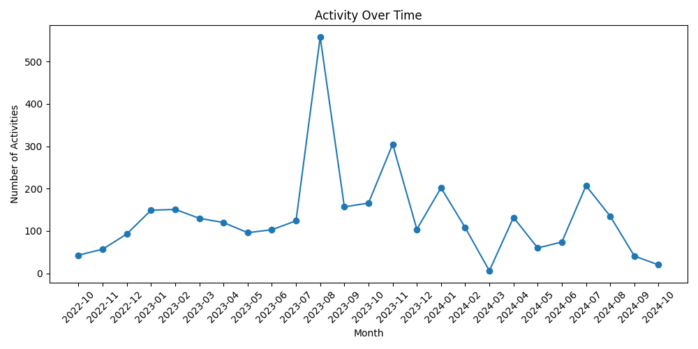
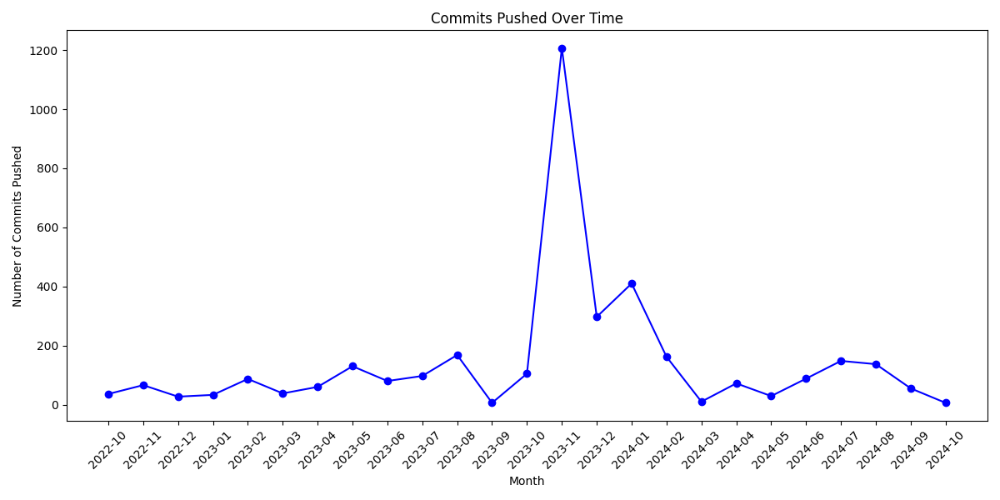
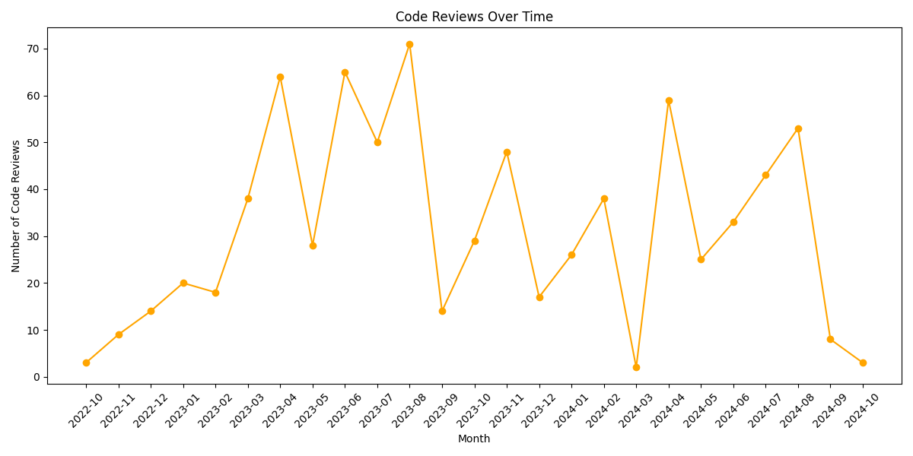
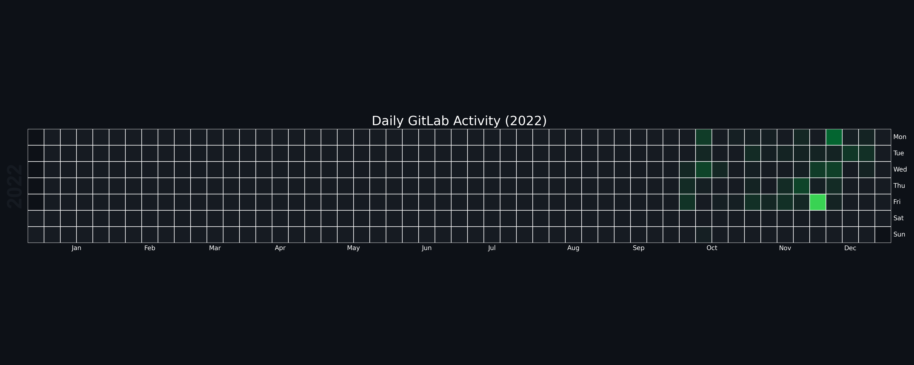
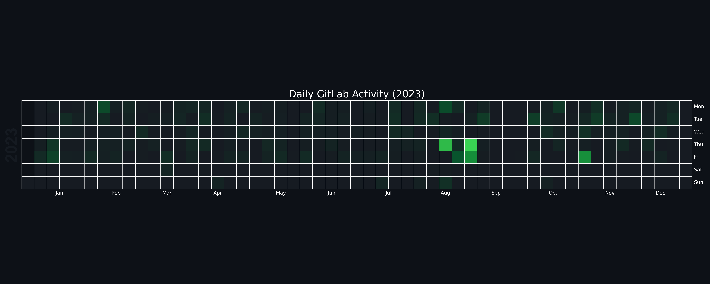
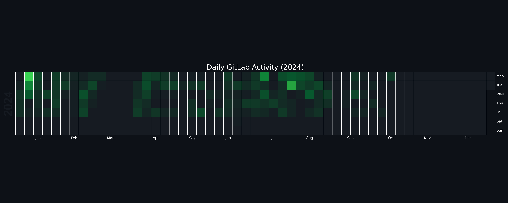

### 💫 About Me:
👋 **Hi, I’m Jay (MBCS)** — a research-minded software engineer who builds open-source infrastructure and applications for universities and non-profits.    
🔧  Rails • Go • Python • Docker/K8s • CI/CD — with a focus on privacy, reliability, and clean documentation.    

### 🔝 Top Contributed Repo

### 📊 GitHub Stats:

### 🏆 GitHub Trophies

---

## 📊 GitLab Activity Stats (Oct 2022 - Oct 2024)

While working for ORA team at the **Bodleian Libraries**, **University of Oxford**, I contributed to a self-hosted GitLab instance between October 2022 and October 2024. Below are some of the key metrics from my activity:

- **Total Events:** `3341`
- **Total Commits Pushed:** `3554`
- **Total Push Events:** `595`
- **Issues Opened:** `238`
- **Issues Closed:** `818`
- **Merge Requests Opened:** `140`
- **Merge Requests Accepted:** `54`
- **Merge Requests Closed:** `18`
- **Merge Requests Approved:** `6`
- **Code Reviews Made:** `778`
- **Wiki Pages Created:** `45`
- **Wiki Pages Updated:** `116`
- **Wiki Pages Destroyed:** `2`
- **Milestones Opened:** `1`
- **Work Items Opened:** `188`
- **Work Items Closed:** `186`
- **Projects Joined:** `4`
- **Deleted Events:** `129`
- **Projects Contributed To:** `26`
<!--
### 💻 Tech Stack:
                                                         

### 🌐 Socials:
  

### 📈 Activity Over Time

#### **Monthly Activity**

#### **Commits Pushed Over Time**

#### **Code Reviews Over Time**

### 🗓️ Daily Activity Calendar

#### **2022**

#### **2023**

#### **2024**

---

<!-- Proudly created with GPRM ( https://gprm.itsvg.in ) -->
